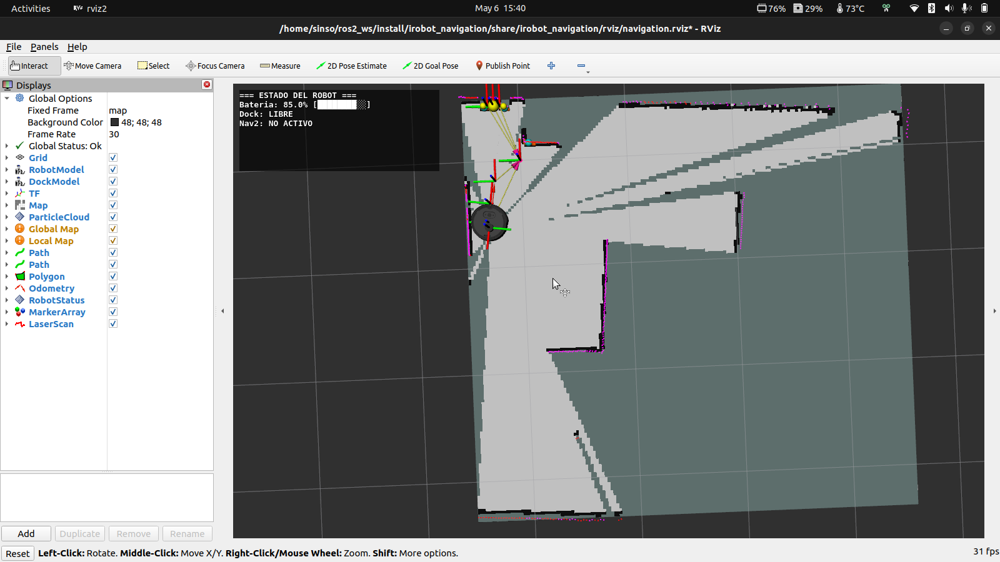
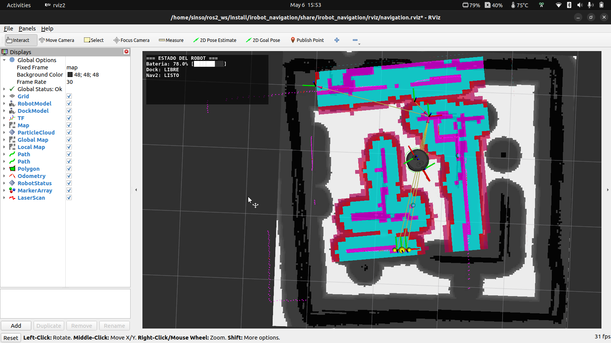
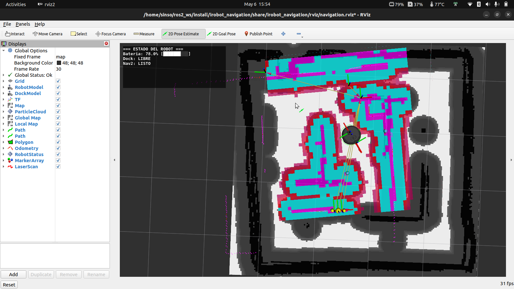
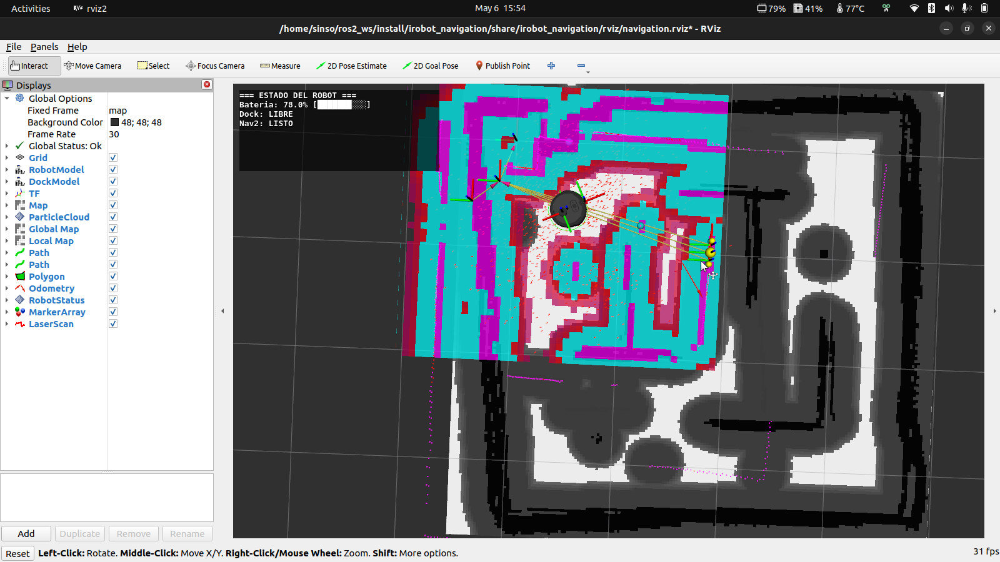
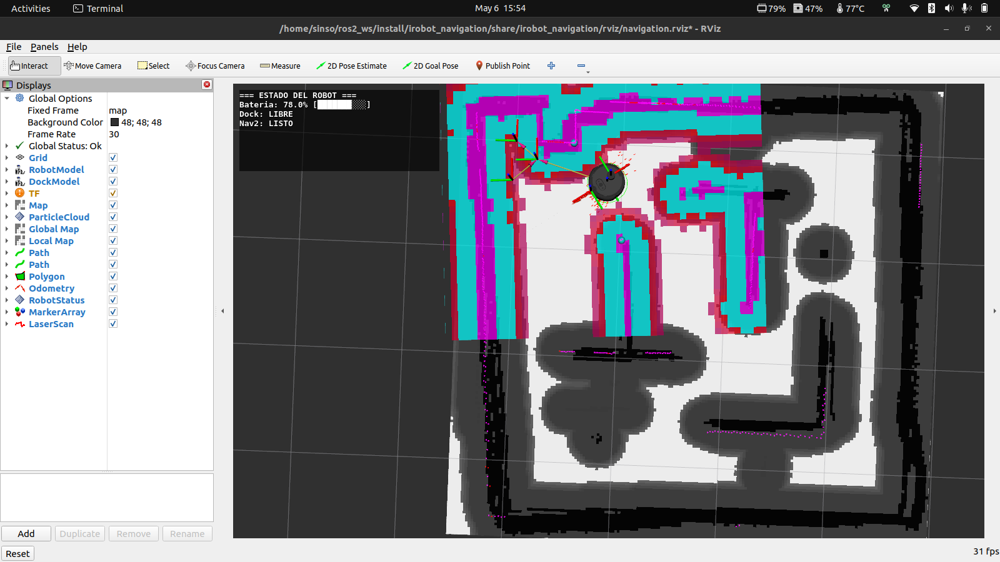
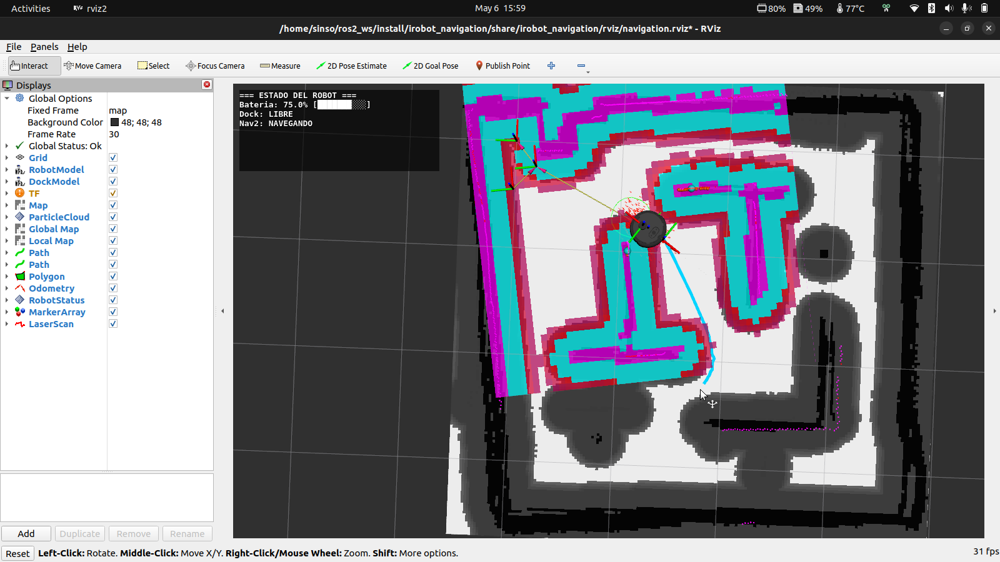

# RRBOT Demos

Nodos ROS 2 de demostración para el RRBOT, un robot basado en iRobot Create 3. Diseñados para ejecutarse directamente desde tu laptop conectada al robot del laboratorio remoto.

Todos los códigos están en:

```
irobot_demos/irobot_demos/
```

Son archivos Python simples — ábrelos, léelos y modifícalos libremente. Cada uno es independiente y está pensado para que lo experimentes.

---

## Prerequisitos

- ROS 2 Humble instalado en tu laptop (esto se hace automáticamente la primera vez que ejecutas el comando de conexión al robot)
- Conectado al laboratorio remoto

---

## Inicio rápido

### 1. Crear el workspace y clonar

```bash
mkdir -p ~/rrbot_ws/src
cd ~/rrbot_ws/src
git clone https://github.com/Kalman-Robotics/irobot-create3-demos.git
```

> **Importante:** el clone debe hacerse dentro de `~/rrbot_ws/src/`, no en `~/rrbot_ws/`. Si ves errores de paquetes duplicados es porque el repo quedó en el lugar incorrecto.

### 2. Instalar dependencias del sistema

```bash
cd ~/rrbot_ws
sudo rosdep init
rosdep update
rosdep install --from-paths src --ignore-src -r -y
```

### 3. Compilar

```bash
cd ~/rrbot_ws
colcon build --packages-up-to irobot
source install/setup.bash
echo "source ~/rrbot_ws/install/setup.bash" >> ~/.bashrc
```

> [!WARNING]
> **Desacople obligatorio antes de cualquier demo**
>
> El iRobot Create 3 arranca acoplado a su estación de carga (la base donde se conecta el robot para cargar la batería). Antes de lanzar cualquier demo debes desacoplarlo ejecutando:
>
> ```bash
> ros2 action send_goal /undock irobot_create_msgs/action/Undock "{}"
> ```
>
> El robot retrocederá de la estación de carga y quedará listo para recibir comandos de movimiento.

---

## DEMOS

<details>
<summary><b>Demos disponibles</b></summary>

> **Orientación del robot:** la parte delantera del iRobot Create 3 se referencia por la flecha dibujada.

### Sin LiDAR

Estos demos solo necesitan odometría o IMU — el LiDAR puede estar apagado.

---

### `cuadrado` — Traza un cuadrado usando odometría

Para este primer demo se recomienda que el robot esté posicionado en un punto despejado para que pueda realizar el cuadrado. Puedes conseguirlo llevando al robot con el joystick virtual. Puedes aumentar el tamaño del cuadrado con el parámetro `lado`, pero asegúrate siempre de que haya suficiente espacio libre alrededor para que el robot no choque y complete el recorrido correctamente.

Abre un terminal nuevo y ejecuta:

```bash
ros2 run irobot_demos cuadrado
```

Para cambiar el tamaño del lado (en metros):

```bash
ros2 run irobot_demos cuadrado --ros-args -p lado:=0.6
```

**Qué hace:** El robot avanza un lado, gira 90°, y repite cuatro veces. Al completar el cuadrado el nodo se detiene solo.

**Qué usa:**
- `/odom` (`nav_msgs/Odometry`) — lee posición `(x, y)` y orientación `yaw` para saber cuánto ha avanzado y girado
- `/cmd_vel` (`geometry_msgs/Twist`) — envía comandos de velocidad lineal y angular

**Parámetro:** `lado` (metros, default `0.4`)

**Código:** [irobot_demos/cuadrado.py](irobot_demos/irobot_demos/cuadrado.py)

---

### `control_p` — Controlador proporcional de orientación

Para este demo se recomienda llevar al robot al centro del escenario.

**Qué hace:** El robot gira hasta alcanzar un ángulo objetivo (relativo a su orientación inicial) y se detiene. La velocidad angular es proporcional al error: gira rápido cuando está lejos del objetivo y frena suavemente al acercarse.

Abre un terminal nuevo y ejecuta. Puedes probar distintos ángulos — el robot girará hasta alcanzarlo y se detendrá:

**Ángulo por defecto (90°):** el robot gira 90° a la izquierda.

```bash
ros2 run irobot_demos control_p
```

**Ángulo personalizado (150°):** cambia el valor para girar más.

```bash
ros2 run irobot_demos control_p --ros-args -p angulo_objetivo:=150.0
```

**Ángulo negativo (-45°):** un valor negativo hace que el robot gire a la derecha.

```bash
ros2 run irobot_demos control_p --ros-args -p angulo_objetivo:=-45.0
```

**Qué usa:**
- `/odom` (`nav_msgs/Odometry`) — lee la orientación `yaw` actual del robot
- `/cmd_vel` (`geometry_msgs/Twist`) — envía velocidad angular proporcional al error

**Parámetro:** `angulo_objetivo` (grados, default `90.0`)

**Código:** [irobot_demos/control_p.py](irobot_demos/irobot_demos/control_p.py)

---

### `telemetria_live` — Dashboard en terminal

Abre un terminal nuevo y ejecuta:

```bash
ros2 run irobot_demos telemetria_live
```

**Qué hace:** Muestra un panel actualizado a 2 Hz con: posición `(x, y)` y orientación, velocidad lineal y angular, voltaje y porcentaje de batería, estado de la estación de carga (cargando / libre) y ángulos roll/pitch del IMU. No envía nada al robot — es solo lectura.

> **Cómo usarlo:** abre el joystick en el navegador del laboratorio, mueve el robot y observa cómo cambian en tiempo real la posición y la velocidad en el panel. Para detener el panel, presiona `Ctrl+C` en el terminal.

**Qué usa:**
- `/odom` (`nav_msgs/Odometry`) — posición, orientación y velocidades
- `/battery_state` (`sensor_msgs/BatteryState`) — voltaje y porcentaje de batería
- `/imu` (`sensor_msgs/Imu`) — roll y pitch
- `/dock_status` (`irobot_create_msgs/DockStatus`) — estado de la estación de carga (si el paquete está disponible)

**Código:** [irobot_demos/telemetria_live.py](irobot_demos/irobot_demos/telemetria_live.py)

---

### Con LiDAR

El RRBOT lleva un **LiDAR C1 de Slamtec** montado en el chasis. Este sensor mide distancias en 360° alrededor del robot y es lo que permite esquivar obstáculos, seguir paredes o explorar un espacio de forma autónoma. Todos los demos de esta sección lo usan como fuente principal de percepción.

El LiDAR **arranca automáticamente** con el robot. Puedes verificar que esté publicando antes de lanzar cualquier demo:

```bash
ros2 topic hz /scan
```

A partir de aquí ya puedes ejecutar los demos que usan el LiDAR.

---

### `radar` — Visualiza lo que ve el LiDAR en tiempo real

Antes de lanzar cualquier demo autónomo, se recomienda empezar aquí. Este demo te muestra exactamente qué está detectando el LiDAR del robot: los obstáculos aparecen como puntos en un mapa centrado en el robot, actualizado en tiempo real. Entender lo que ve el sensor es clave para interpretar el comportamiento de los demás demos.

Abre un terminal nuevo y ejecuta:

**Opción 1 — configuración por defecto:**

```bash
ros2 run irobot_demos radar
```

**Opción 2 — ajustar escala y radio de visión:** útil si quieres ver obstáculos más lejanos o con más detalle cercano.

```bash
ros2 run irobot_demos radar --ros-args -p escala:=0.05 -p radio:=2.0
```

**Qué hace:** Dibuja un mapa ASCII de 61×31 caracteres centrado en el robot donde `↓` representa el robot (apuntando hacia abajo = frente) y cada `X` es un obstáculo detectado por el LiDAR en el frame del robot. Se actualiza a ~2 Hz.

> **Visualización completa con RViz:** para ver el modelo del robot, el LiDAR y la odometría en tiempo real con gráficos, usa RViz:
>
> ```bash
> ros2 run rviz2 rviz2 -d ~/rrbot_ws/src/irobot-create3-demos/irobot_demos/rviz/rrbot.rviz
> ```

**Qué usa:**
- `/scan` (`sensor_msgs/LaserScan`) — lecturas del LiDAR convertidas a coordenadas del robot

**Parámetros:** `escala` (metros por celda, default `0.05`) · `radio` (alcance máximo a mostrar en metros, default `2.0`)

**Código:** [irobot_demos/radar.py](irobot_demos/irobot_demos/radar.py)

---

### `evitar_obstaculos` — Avanza y esquiva obstáculos

Gracias al LiDAR, el robot puede detectar obstáculos antes de chocar y decidir hacia dónde esquivarlos. Este demo es una buena introducción a cómo el sensor se traduce en comportamiento reactivo.

Abre un terminal nuevo y ejecuta:

```bash
ros2 run irobot_demos evitar_obstaculos
```

**Qué hace:** El robot avanza en línea recta. Cuando el LiDAR detecta un obstáculo al frente a menos de 55 cm, gira hacia el lado con más espacio libre hasta despejarse y retoma el avance.

**Qué usa:**
- `/scan` (`sensor_msgs/LaserScan`) — lee las distancias al frente, izquierda y derecha que reporta el LiDAR
- `/cmd_vel` (`geometry_msgs/Twist`) — envía comandos de avance o giro según lo que detecte el sensor

**Código:** [irobot_demos/evitar_obstaculos.py](irobot_demos/irobot_demos/evitar_obstaculos.py)

---

### `explorador` — Patrullaje autónomo continuo

Este demo lleva el uso del LiDAR un paso más allá: en lugar de reaccionar solo cuando hay un obstáculo, el robot analiza continuamente todo el semicírculo frontal para elegir siempre la dirección más despejada.

Abre un terminal nuevo y ejecuta:

**Opción 1 — burbuja de seguridad por defecto (45 cm):**

```bash
ros2 run irobot_demos explorador
```

**Opción 2 — burbuja más grande (60 cm):** el robot se mantendrá más alejado de las paredes laterales.

```bash
ros2 run irobot_demos explorador --ros-args -p burbuja:=0.60
```

**Qué hace:** El robot siempre está en movimiento. Cada ciclo usa las lecturas del LiDAR para buscar la ventana más despejada en el semicírculo frontal y orienta el robot hacia allá suavemente. Si algún lateral entra en la "burbuja" de seguridad, corrige la dirección para alejarse. No hay estados discretos — el movimiento es fluido y continuo.

**Qué usa:**
- `/scan` (`sensor_msgs/LaserScan`) — análisis continuo del semicírculo frontal y laterales con el LiDAR
- `/cmd_vel` (`geometry_msgs/Twist`) — velocidad lineal constante + angular variable

**Parámetro:** `burbuja` (metros, radio de seguridad lateral, default `0.45`)

**Código:** [irobot_demos/explorador.py](irobot_demos/irobot_demos/explorador.py)

---

## Resumen de tópicos usados

| Tópico | Tipo | Usado por |
|---|---|---|
| `/cmd_vel` | `geometry_msgs/Twist` | cuadrado, espiral, control_p, antivuelco, evitar_obstaculos, explorador, seguidor_paredes |
| `/odom` | `nav_msgs/Odometry` | cuadrado, control_p, telemetria_live |
| `/scan` | `sensor_msgs/LaserScan` | evitar_obstaculos, explorador, seguidor_paredes, radar |
| `/imu` | `sensor_msgs/Imu` | antivuelco, telemetria_live |
| `/battery_state` | `sensor_msgs/BatteryState` | telemetria_live |
| `/estación de carga_status` | `irobot_create_msgs/DockStatus` | telemetria_live |

</details>

<details>
<summary><b>Navegación Autónoma</b></summary>

El RRBOT puede construir un mapa del entorno, localizarse dentro de él y planificar rutas hacia un destino evitando obstáculos en tiempo real. Esta sección cubre el flujo completo: verificar sensores, mapear el espacio y luego navegar de forma autónoma.

Antes de empezar, asegúrate de que el robot está desacoplado de la estación de carga:

```bash
ros2 action send_goal /undock irobot_create_msgs/action/Undock "{}"
```

---

### Paso 1 — Verificar sensores con `monitor`

Antes de mapear o navegar, confirma que el robot está publicando datos correctamente. Este launch abre RViz con el modelo del robot, el LiDAR, la odometría y el overlay de estado — si ves todo activo, el robot está listo.

```bash
ros2 launch irobot_navigation monitor.launch.py
```

**Qué hace:** Lanza RViz con una configuración ligera (sin Nav2) que muestra el modelo 3D del robot, las lecturas del LiDAR en tiempo real, la trayectoria de odometría y el panel de estado del robot en pantalla. Es una verificación rápida antes de iniciar cualquier operación autónoma.

**Qué usa:**
- `/scan` (`sensor_msgs/LaserScan`) — lecturas del LiDAR
- `/odom` (`nav_msgs/Odometry`) — posición y orientación del robot
- `/tf` / `/tf_static` — árbol de transformaciones del robot
- `/robot_status_overlay` — estado de batería, dock y velocidad en pantalla

Cuando hayas confirmado que los sensores están activos, cierra este launch con `Ctrl+C` y continúa al siguiente paso.

---

### Paso 2 — Construir el mapa con SLAM Toolbox

Con los sensores verificados, mapea el entorno. Mueve el robot lentamente por todo el espacio — cuanto más lo recorras, mejor será el mapa resultante.

```bash
ros2 launch irobot_navigation autonomous_nav.launch.py use_sim_time:=false slam:=true rviz:=true
```

**Qué hace:** Lanza SLAM Toolbox, que combina las lecturas del LiDAR con la odometría para construir un mapa de ocupación en tiempo real. RViz muestra el mapa creciendo a medida que el robot explora.

**Qué usa:**
- `/scan` (`sensor_msgs/LaserScan`) — contornos del entorno detectados por el LiDAR
- `/odom` (`nav_msgs/Odometry`) — desplazamiento acumulado del robot
- `/tf` — posición del robot dentro del mapa

> **Tip:** mueve el robot despacio y con giros amplios para que SLAM Toolbox tenga tiempo de procesar cada zona. Los pasillos estrechos o esquinas sin recorrer quedan como zonas desconocidas en el mapa.

<p align="center">
  <br/>
  <em>Mapa de ocupación en construcción: blanco = espacio libre, negro = obstáculo, gris = zona no explorada aún.</em>
</p>

Cuando el mapa se vea completo, **guárdalo antes de cerrar el launch**. Abre un terminal nuevo y ejecuta desde la carpeta donde quieras guardar el mapa:

```bash
mkdir -p ~/mis_mapas && cd ~/mis_mapas
ros2 service call /slam_toolbox/save_map slam_toolbox/srv/SaveMap "name:
  data: '$(pwd)/mi_mapa'"
```

Esto genera `mi_mapa.pgm` y `mi_mapa.yaml` en `~/mis_mapas/`. Para usar ese mapa en la navegación, pásalo con el argumento `map`:

```bash
ros2 launch irobot_navigation autonomous_nav.launch.py use_sim_time:=false \
  localization:=true nav2:=true rviz:=true \
  map:=~/mis_mapas/mi_mapa.yaml
```

Si omites `map:=`, se usará el mapa incluido por defecto en el paquete.

---

### Paso 3 — Navegar de forma autónoma

Con el mapa guardado en el Paso 2, lanza la navegación autónoma usando tu propio mapa:

```bash
ros2 launch irobot_navigation autonomous_nav.launch.py use_sim_time:=false \
  localization:=true nav2:=true rviz:=true \
  map:=~/mis_mapas/mi_mapa.yaml
```

Si no tienes un mapa propio, puedes omitir `map:=` y el paquete usará el mapa incluido por defecto:

```bash
ros2 launch irobot_navigation autonomous_nav.launch.py use_sim_time:=false localization:=true nav2:=true rviz:=true
```

**Qué hace:** Lanza Nav2 con localización AMCL sobre el mapa existente. El robot planifica rutas, evita obstáculos en tiempo real y se desplaza de forma autónoma hacia los objetivos que le indiques desde RViz.

**Qué usa:**
- `/scan` (`sensor_msgs/LaserScan`) — detección de obstáculos en tiempo real durante la navegación
- `/odom` (`nav_msgs/Odometry`) — estimación de posición dentro del mapa
- `/map` (`nav_msgs/OccupancyGrid`) — mapa de referencia para planificación de rutas
- `/cmd_vel` (`geometry_msgs/Twist`) — comandos de velocidad generados por Nav2

**Cómo usarlo una vez lanzado:**

1. Al abrirse RViz el robot aparece con una pose inicial en el mapa, pero AMCL aún no ha confirmado su posición real — las partículas están concentradas en ese punto inicial pero la localización es solo una estimación de partida.

<p align="center">
  <br/>
  <em>Estado inicial — el robot tiene una pose de partida, pero AMCL necesita relocalizar para confirmar la posición real.</em>
</p>

2. Selecciona la herramienta **"2D Pose Estimate"** y haz clic en el mapa en la posición real del robot, arrastrando en la dirección en la que apunta, para indicarle a AMCL desde dónde relocalizar.

<table align="center">
  <tr><td align="center"><br/><em>Seleccionar la herramienta y hacer clic en el mapa</em></td></tr>
  <tr><td align="center"><br/><em>Pose enviada — las partículas del AMCL aparecen concentradas en la zona indicada</em></td></tr>
  <tr><td align="center"><br/><em>Tras girar el robot manualmente, las partículas convergen y la localización mejora</em></td></tr>
</table>

3. Selecciona la herramienta **"2D Nav Goal"** y haz clic en el destino dentro del mapa. El robot calculará una ruta y se desplazará automáticamente hasta allí.

<table align="center">
  <tr><td align="center"><br/><em>Seleccionar destino con la herramienta 2D Nav Goal</em></td></tr>
  <tr><td align="center"><br/><em>Nav2 calcula la ruta y el robot se desplaza automáticamente</em></td></tr>
</table>

---

### Alternativa — Navegar mientras se construye el mapa (SLAM + Nav2)

Si no tienes un mapa guardado o quieres explorar un entorno nuevo, puedes mapear y navegar al mismo tiempo. El robot construye el mapa en tiempo real y lo usa simultáneamente para planificar rutas.

```bash
ros2 launch irobot_navigation autonomous_nav.launch.py use_sim_time:=false slam:=true nav2:=true rviz:=true
```

**Qué hace:** Lanza SLAM Toolbox y Nav2 juntos. El mapa se va construyendo a medida que el robot se mueve y Nav2 lo usa en tiempo real para planificar rutas hacia los objetivos que le indiques. No requiere una pose inicial — SLAM mantiene la localización del robot desde el arranque.

**Qué usa:**
- `/scan` (`sensor_msgs/LaserScan`) — construcción del mapa y detección de obstáculos
- `/odom` (`nav_msgs/Odometry`) — estimación de posición del robot
- `/map` (`nav_msgs/OccupancyGrid`) — mapa parcial en crecimiento usado por Nav2
- `/cmd_vel` (`geometry_msgs/Twist`) — comandos de velocidad generados por Nav2

> **Cuándo usarlo:** útil para explorar un entorno desconocido y navegar dentro de él sin necesidad de un paso previo de mapeo. El mapa crece con cada zona que el robot recorre — cuanto más explores, más completo estará el mapa disponible para planificar rutas.

---

## Resumen de launches de navegación

| Launch | Propósito |
|---|---|
| `monitor.launch.py` | Verificar sensores, LiDAR, odometría y estado del robot |
| `autonomous_nav.launch.py slam:=true rviz:=true` | Construir el mapa con SLAM Toolbox |
| `autonomous_nav.launch.py localization:=true nav2:=true rviz:=true` | Navegación autónoma con mapa existente |
| `autonomous_nav.launch.py slam:=true nav2:=true rviz:=true` | SLAM y navegación simultáneos sin mapa previo |

</details>